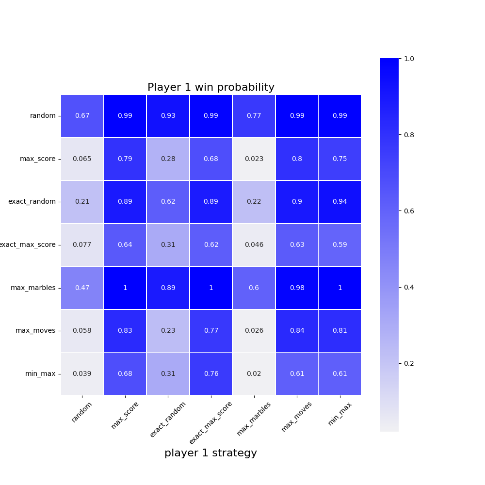

# mancala
Exploring different strategies for the board game [mancala](https://en.wikipedia.org/wiki/Mancala), also known as Kalaha.

## Rules
* Mancala is a two-player zero-sum game, where players compete to capture more marbles than their opponent.
* Each player has six buckets, initially containing four marbles. They also have a score bucket.
* A move is made by player one choosing one of their six buckets, collecting all their marbles.
* The player then distributes the marbles in subsequent buckets, including the player's score bucket, moving in a anti-clockwise direction until no marbles remain.
* The opponent's score bucket is skipped over.

* Some further rules are applied:
	* If the player ends in a non-zero bucket, then they collect the stones in that bucket and continue moving anti-clockwise around the board.
	* If the player ends their turn in their score bucket, then they get to choose a new move from their non-zero buckets.
	* If the player ends in an empty bucket, then the player's turn is over.
* The game is over when either half of the marbles have been captured, or one player manages to empty all the buckets on their side.
* Any remaining marbles on each player's side are added to their total. The winner is the player with the most marbles

## Blog post
* A short article describing this work can be found [here](https://sdysch.github.io/Simulating_Mancala_part_1/)

## Strategies

| Strategy        | Explanation                                                                                                                             |
| --------        | -----------                                                                                                                             |
| Random          | Moves are chosen with an equal probability                                                                                              |
| Max score       | The move which maximises the player's score is chosen. If multiple moves give the same max score, choose randomly                       |
| Exact Random    | If possible, choose a move which ends in player's goal. Otherwise, use random strategy                                                  |
| Exact Max Score | Same as Exact Random, except that the fallback strategy is Max score                                                                    |
| Max marbles     | Choose the move which has the most marbles. If multiple moves fit this criteria, choose randomly                                        |
| Max moves       | The move which maximises the number of moves a player makes is chosen. If multiple moves give the same number, choose randomly          |
| MinMax          | Minimax algorithm (with configurable depth)                                                                                             |

## Player 1 win probabilities

## Todo list
Current to do list: [here](TODO.md)
